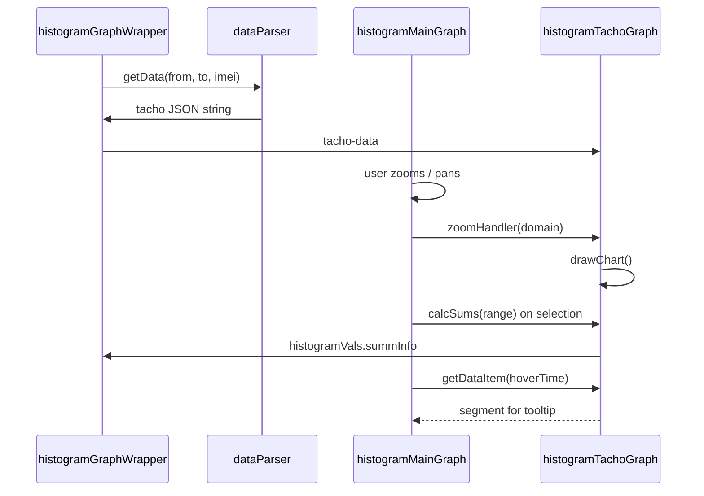

# Histogram Tacho Graph

> **See also:** [Tacho history – status tooltips](../tachoHistory/shared/tachoHistory.md#clicking) for the shared tooltip component behaviour (`c-tacho-history-tooltip`).

## Overview

The **histogram tacho graph** (`c-histogram-tacho-graph`) is the tachograph strip in the vehicle history histogram view. It shows driver activity (rest, work, drive) as a horizontal timeline aligned with the main telematics graph below it.

The component lives inside `c-histogram-graph-wrapper`, between the task graph and the main histogram graph:

| Layer | Component | Role |
|-------|-----------|------|
| Top | `c-histogram-task-graph` | Task markers |
| Middle | **`c-histogram-tacho-graph`** | Tachograph status bars |
| Bottom | `c-histogram-main-graph` | Telematics lines, zoom, range selection |

```
┌─────────────────────────────────────────────┐
│  histogram-section-info / zoom buttons      │
├─────────────────────────────────────────────┤
│  task graph                                 │
├─────────────────────────────────────────────┤
│  tacho graph  ← this component              │
├─────────────────────────────────────────────┤
│  main telematics graph                      │
├─────────────────────────────────────────────┤
│  legend                                     │
└─────────────────────────────────────────────┘
```

## User-facing behaviour

### Status colours

Each segment is coloured by tachograph status:

| Status | Colour token | Typical appearance |
|--------|--------------|-------------------|
| `rest` | `--rest-color` / `--rtcl-surface` | Light / neutral |
| `work` | `--work-color` / `--rtcl-global-salmon` | Salmon |
| `drive` | `--drive-color` / `--rtcl-primary` | Teal / primary |
| `driver-available` | `--driver-available-color` / `--rtcl-global-lime` | Lime |

Colours are shared with tacho history via `tachoStatusStyles` from `c/tachoHistory`.

### Driver change marker

When the driver changes between consecutive segments, the new segment is flagged with `driverChanged: true` during data parsing. The graph renders a small circle at the segment start (purple border, lavender fill) so handovers are visible on the timeline.

### Click tooltip

Clicking a status rectangle opens `c-tacho-history-tooltip` (same component family as [tacho history rows](../tachoHistory/shared/tachoHistory.md)).

The tooltip shows:

- Driver name and initials (when `firstName` / `lastName` are present)
- Status type with icon
- From / to time
- Duration

Tooltip position flips based on click location (top/bottom, left/right) so it stays on screen. Blur closes the tooltip.


### Zoom synchronisation

The tacho strip does **not** have its own zoom controls. It follows the main graph zoom domain:

- Mouse wheel / drag zoom on the main graph
- Zoom in / zoom out buttons in the wrapper
- Range selector on the main graph

When the visible time range changes, `histogramMainGraph` calls `zoomHandler` on this component so segment positions and widths are recalculated.

### Summary totals

When the user selects a range on the main graph, `calcSums` aggregates work, drive, and rest time inside that interval and writes the result to `wrapper.histogramVals.summInfo` (shown in `c-histogram-section-info`).

### Main graph hover integration

The main graph tooltip calls `getDataItem(time)` to resolve the tachograph status at the hovered timestamp and display driver name and status alongside telematics values.

## Data source

### API

Tacho segments are loaded with the rest of histogram data in `histogramGraphWrapper/dataParser.js`:

- Endpoint: `vehicle_tacholist?from={from}&to={to}&imei={imei}`
- Parsed by `parseTachoData()` before being passed to the component as a JSON string (`tacho-data`).

### Parsed item shape

Each segment after `parseTachoData`:

| Field | Type | Description |
|-------|------|-------------|
| `from` | `number` | Start timestamp (ms) |
| `to` | `number` | End timestamp (ms) |
| `sum` | `number` | `to - from` |
| `status` | `string` | `rest`, `work`, `drive`, etc. |
| `firstName`, `lastName` | `string` | Driver name |
| `driverTachoCardID` | `string` | Driver identifier |
| `driverChanged` | `boolean` | `true` when driver changed from previous segment |
| `name` | `string` | `"${firstName} ${lastName}"` |

Parsing rules:

- Sorted by `from`
- Segments shorter than 1 ms or duplicate `from` values are dropped
- On driver change, the previous segment’s `to` is trimmed to the new segment’s `from`

### Status normalisation

API status strings are normalised in the component with `normalizeStatus()` (`toLowerCase()`, spaces → `-`), matching the approach in `c/tachoHistory`. This keeps CSS classes and fill colours consistent regardless of API casing.

## Technical architecture

### Component location

```
force-app/main/default/consoleComponents/history/lwc/histogramTachoGraph/
├── histogramTachoGraph.html
├── histogramTachoGraph.js
├── histogramTachoGraph.css
└── histogramTachoGraph.js-meta.xml
```

### Rendering approach

The graph uses **d3** with an **SVG** rendered into a manual DOM region (`lwc:dom="manual"`), following the same pattern as `c-tacho-history-row`:

1. `renderedCallback` initialises the SVG once d3 and `wrapperSvg` ref are ready
2. `drawChart()` rescales the time axis and runs a d3 data join on visible segments
3. Segments are `<rect>` elements; driver-change markers are `<circle>` elements

Previously, segments were absolutely positioned `<div>` elements driven by `summData`. The SVG approach was adopted to support click tooltips and stay aligned with tacho history rendering.

### Visibility filter

`getVisibleData()` returns segments that overlap the current x-scale domain and have either:

- positive pixel width, or
- `driverChanged === true` (zero-width handover markers still render)

### D3 data join

- Key: `` `${from}-${to}` ``
- Enter: append `<rect>`, attach click handler
- Update + enter (merge): set `class`, `fill`, `x`, `y`, `width`, `height`

**Important:** `class` and `fill` must be applied on the **merged** selection (every `drawChart` call), not only on `.enter()`. Dynamically created SVG nodes inside `lwc:dom="manual"` do not reliably pick up scoped LWC CSS on first paint; without an explicit `fill`, SVG defaults to black. This is especially visible on edge segments revealed after zoom out.

Fill values use CSS variables via inline `fill` attribute:

```javascript
const STATUS_FILL = {
  rest: "var(--rest-color, var(--rtcl-surface))",
  work: "var(--work-color, var(--rtcl-global-salmon))",
  drive: "var(--drive-color, var(--rtcl-primary))",
  "driver-available": "var(--driver-available-color, var(--rtcl-global-lime))",
};
```

`static stylesheets = [tachoStatusStyles]` ensures `--rest-color`, `--work-color`, and `--drive-color` are defined on the component host.

## Public API (`@api`)

| Method | Called by | Purpose |
|--------|-----------|---------|
| `zoomHandler({ detail: { from, to } })` | `histogramMainGraph` / `zoomArea` | Update x-scale domain and redraw |
| `calcSums({ detail: { from, to } })` | `rangeSelector` | Compute work/drive/rest totals for selected range |
| `getDataItem(time)` | Main graph `tooltip` | Resolve tacho segment at hover timestamp |
| `drawChart()` | Wrapper `redraw`, resize listener | Rescale and redraw all segments |
| `closeTooltip()` | Internal / blur handler | Hide click tooltip |

### Inputs

| Property | Source | Description |
|----------|--------|-------------|
| `tacho-data` | `histogramGraphWrapper` (`data.tacho`) | JSON string of parsed segment array |
| `wrapper` | Parent | Console wrapper state (used by `calcSums`) |

## Integration flow



## Related components

| Component | Relationship |
|-----------|--------------|
| `c-histogram-graph-wrapper` | Parent; loads data, hosts layout |
| `c-histogram-main-graph` | Drives zoom domain and range selection |
| `c-histogram-section-info` | Displays `summInfo` totals from `calcSums` |
| `c-tacho-history-tooltip` | Click tooltip UI |
| `c-tacho-history-row` | Reference implementation for SVG + tooltip pattern |
| `c/tachoHistory` (`tachoStatusStyles`) | Shared status colour variables |

## Testing notes

1. Open histogram for a truck with tachograph data and confirm rest / work / drive colours render correctly at full zoom.
2. Zoom in, then zoom out one or more steps — edge segments should keep correct colours immediately (no black rectangles).
3. Click a segment — tooltip shows driver, status, times, and duration.
4. Drag the range selector on the main graph — section info totals update.
5. Hover the main graph — tooltip includes driver and status from `getDataItem`.
6. Use a segment where the driver changes — purple-bordered circle appears at the handover point.

## Changelog

| Date | Change |
|------|--------|
| 2023-09-14 | Initial version (div-based rendering) |
| 2026 | Migrated to d3 SVG + `c-tacho-history-tooltip`; explicit `fill` on merged selection; `tachoStatusStyles` import; status normalisation |
